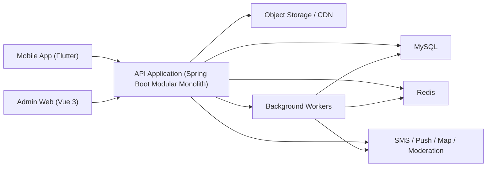

# 宠物生活管家技术设计

## 1. 背景与假设

### 1.1 产品背景

当前产品已经明确为一个围绕 `宠物数字档案` 运转的养宠生活平台，核心链路为：

`宠物档案 -> 健康/日常记录 -> 成长时间轴 -> 社区分享 -> 服务与设备补充`

### 1.2 当前阶段假设

1. 当前交付目标以 `iOS + Android App` 用户端为主，同时同步建设最小可用后台。
2. 第一阶段优先用户增长和留存，不为支付、会员、供应链过度设计。
3. 社区内容、图片视频、宠物记录是高频写入场景。
4. 商城保留真实占位页，但当前不进入后端交易接口和订单链路。
5. 设备联动只做技术预留，当前不接入设备厂商，也不建设 IoT 接入能力。

### 1.3 规模假设

为避免空泛设计，先按以下量级约束方案：

- 注册用户：100 万以内
- DAU：10 万以内
- 日均媒体上传：50 万文件以内
- 日均时间轴事件：300 万以内
在这个量级下，不需要一开始拆成多套微服务，但必须保留清晰模块边界和异步处理能力。

### 1.4 当前实现边界

1. 当前交付包含用户端 App、用户端所需服务端接口，以及审核/举报/服务商维护等最小可用后台能力。
2. 商城仅实现用户端占位页，不进入 `commerce` 模块的后端实现批次。
3. `device` 模块停留在接口边界和数据结构预留，不接入厂商 SDK、云回调或事件链路。
4. 审核、举报处理、服务商数据维护采用最小可用后台 Web，不追求一次性做成完整运营平台。

## 2. 技术目标与约束

## 2.1 技术目标

1. 让宠物主数据成为单一可信源。
2. 支撑高频记录、内容发布、媒体上传和消息提醒。
3. 保证家庭共养的权限正确性。
4. 让时间轴、通知、社区同步可异步扩展，设备事件链路只保留后续扩展位。
5. 控制早期研发复杂度，优先可迭代性和正确性。

## 2.2 非功能约束

1. 健康记录、家庭关系、联系方式、设备绑定属于敏感数据，不能粗放处理。
2. 社区存在用户生成内容，必须有审核和举报闭环。
3. 设备事件可能重复上报，必须保证幂等。
4. 订单、预约、提醒处理属于状态机业务，不能只靠前端控制状态。

## 2.3 关键设计判断

### 2.3.1 采用模块化单体，而不是直接微服务

原因：

- 当前阶段最重要的是业务边界清晰，而不是部署边界复杂。
- 绝大部分核心链路都共享 `宠物` 主数据，过早拆分会放大一致性成本。
- 早期团队通常无法同时稳定维护多个服务、网关、注册中心、链路治理和跨服务事务。

代价：

- 单体应用代码边界必须靠模块治理，而不是靠服务隔离自然形成。
- 后续某些域要拆出服务时，需要先保证接口和事件边界稳定。

### 2.3.2 采用事件派生读模型，而不是所有页面都直接拼业务表

原因：

- 首页、时间轴、通知中心、社区同步都需要跨域聚合。
- 直接靠前台联表或接口串查会让性能和一致性不可控。

实现方式：

- 核心业务表仍是事实源。
- 通过 `outbox + worker` 生成时间轴、通知任务、审核任务等派生数据。

## 3. 推荐技术栈

## 3.1 客户端

### 3.1.1 移动端

推荐：`Flutter 3.x`

原因：

1. 一套代码覆盖 iOS 和 Android，适合早期快速迭代。
2. 内容流、卡片、表单、图片视频预览类页面实现效率高。
3. 设备 SDK 可通过 Platform Channel 对接原生能力。
4. 在复杂动态列表和高度一致 UI 场景下，表现稳定。

备选：React Native  
放弃原因：如果后续设备厂商 SDK 偏原生，桥接和版本维护成本通常更高。

### 3.1.2 管理端

当前阶段同步建设最小可用后台 Web，覆盖审核、举报处理、服务商维护和基础配置能力。

推荐：

- `Vue 3 + Vite + Element Plus`

原因：

- 适合后台表单、审核、运营配置、服务商管理、消息管理场景。
- 国内团队普遍熟悉，研发与交付效率高。

## 3.2 服务端

推荐：`Java 21 + Spring Boot 3.x`

配套建议：

- ORM/持久层：`MyBatis-Plus` 或 `MyBatis`
- 参数校验：`Hibernate Validator`
- 权限拦截：`Spring Security + JWT`
- 调度：`Spring Scheduler`，复杂定时任务接 `XXL-Job`

原因：

1. 用户、订单、预约、设备事件、提醒等都属于典型强业务状态场景。
2. Java 在模块化单体、事务边界、后台运维和异步任务方面更稳。
3. 后续若确实需要拆服务，Spring Boot 生态迁移成本较低。

## 3.3 基础设施

- 主数据库：`MySQL 8`
- 缓存：`Redis 7`
- 对象存储：`阿里云 OSS` 或兼容 S3 的对象存储
- CDN：对象存储前置 CDN
- 推送：厂商推送 + APNs/FCM 聚合
- 短信：阿里云短信或等价服务
- 地图与地理服务：高德地图
- 内容审核：阿里云内容安全或等价服务

## 3.4 暂不引入

- 微服务注册中心
- Kafka / RocketMQ 集群
- Elasticsearch / OpenSearch 集群
- WebSocket 常驻连接

这些能力不是不能做，而是当前阶段没有足够收益。

## 4. 系统边界与总体架构



## 4.1 客户端职责

移动端负责：

- 交互与页面渲染
- 表单输入和本地草稿
- 图片视频选择、压缩、上传
- 当前宠物视图切换
- 预留商城占位页和设备预留页的用户端展示

不负责：

- 业务状态机最终判断
- 权限最终判断
- 时间轴聚合
- 审核结论

## 4.2 服务端职责

服务端负责：

- 账号鉴权和会话管理
- 宠物与家庭权限校验
- 健康记录、提醒、时间轴、社区、预约、订单、设备绑定等核心状态
- 派生事件生成
- 通知与审核任务投递
- 首页聚合和推荐基础数据提供

## 4.3 存储边界

- `MySQL`：事实源数据、状态机、强一致业务数据
- `Redis`：热点缓存、会话、短时聚合结果、限流计数
- `OSS/CDN`：图片、视频、报告单、设备图片等大文件

## 4.4 第三方边界

- 短信：只负责验证码发送，不持有业务状态
- 推送：只负责消息送达
- 内容审核：只负责检测和返回风险分
- 地图：只负责地理定位、导航和地址解析
- 设备厂商：当前阶段不接入，仅保留后续适配边界

## 5. 模块拆分与边界

后台采用单仓库、单应用、多业务模块结构。推荐包结构：

```text
com.petlife
├─ common
├─ auth
├─ user
├─ family
├─ pet
├─ health
├─ reminder
├─ dailylog
├─ timeline
├─ community
├─ service
├─ commerce
├─ device
├─ notification
├─ moderation
├─ search
└─ admin
```

当前首批交付模块：

- `auth`
- `user`
- `family`
- `pet`
- `health`
- `reminder`
- `dailylog`
- `timeline`
- `community`
- `service`
- `admin`
- `notification`
- `moderation`

当前只保留边界、不进入实现批次的模块：

- `commerce`
- `device`

## 5.1 auth 模块

职责：

- 短信登录
- token 签发和刷新
- 设备登录态管理
- 黑名单 token 失效

拥有数据：

- 用户登录凭证
- refresh token / session

## 5.2 user / family 模块

职责：

- 用户资料
- 当前城市
- 当前宠物偏好
- 家庭与成员关系
- 成员邀请和角色管理

补充技术表建议：

- `user_settings`
- `family_invitations`

## 5.3 pet 模块

职责：

- 宠物主档案
- 多宠切换
- 宠物归属关系

单一事实源：

- 只有 pet 模块可以修改宠物主数据。

## 5.4 health / reminder 模块

职责：

- 健康记录
- 疫苗、驱虫、体检、用药、异常观察
- 提醒计划、提醒处理

关键规则：

- 健康记录写入后，可派生下一次提醒。
- 提醒完成、跳过只能由 reminder 模块推进状态。

## 5.5 dailylog / timeline 模块

职责：

- 萌宠日常
- 成长时间轴
- 首页部分聚合卡片

关键规则：

- `pet_daily_logs` 是原始记录。
- `pet_timeline_events` 是派生读模型。
- timeline 模块不反向修改源记录。

## 5.6 community 模块

职责：

- 帖子发布、评论、点赞、收藏、举报
- 推荐/关注/同城/问答四类流
- 与日常记录的发布联动

补充技术表建议：

- `community_post_reactions`
- `community_post_favorites`
- `community_reports`

关键规则：

- 社区帖子不是宠物档案事实源。
- 删除帖子不删除原始日常记录。

## 5.7 service 模块

职责：

- 医院、寄养、洗护、训练服务商目录
- 预约管理
- 服务评价和服务记录

补充技术表建议：

- `provider_reviews`
- `provider_service_items`

## 5.8 commerce 模块

当前阶段说明：

- 仅保留用户端占位页和接口边界，不进入后端实现批次。

职责：

- 商品目录
- SKU、购物车、订单
- 地址和结算

补充技术表建议：

- `user_addresses`
- `order_status_logs`

关键规则：

- 订单与预约严格分开建模。
- 支付能力抽象成接口，不作为 v1 必须完成项。

## 5.9 device 模块

当前阶段说明：

- 仅保留技术边界和数据结构预留，不接入设备厂商。

职责：

- 设备绑定
- 设备状态与事件归一化
- 厂商适配
- 设备异常转业务提醒

设计模式：

采用 `DeviceAdapter` 适配器模式：

- `bind()`
- `unbind()`
- `querySnapshot()`
- `pullEvents()`
- `handleWebhook()`

关键规则：

- 设备只归一化为平台事件，不把厂商字段直接泄露到业务层。
- 设备模块不直接写健康记录，只能写 `device_events` 并发出领域事件。

## 5.10 notification / moderation 模块

职责：

- 站内信、推送、短信
- 审核任务派发与结果回写
- 系统消息中心

补充技术表建议：

- `message_templates`
- `moderation_tasks`
- `outbox_events`
- `audit_logs`

## 6. 数据所有权与技术补充表

## 6.1 单一事实源原则

| 业务对象 | 单一事实源 |
|---|---|
| 宠物主档 | `pets` |
| 家庭关系 | `families` / `family_members` |
| 健康记录 | `pet_health_records` |
| 提醒 | `pet_reminders` |
| 萌宠日常 | `pet_daily_logs` |
| 时间轴 | `pet_timeline_events`（派生层） |
| 社区帖子 | `community_posts` |
| 服务预约 | `service_appointments` |
| 商品订单 | `orders` / `order_items` |
| 设备绑定 | `device_bindings` |
| 设备事件 | `device_events` |
| 通知 | `notifications` |

## 6.2 技术补充表

产品层数据模型之外，后端需要补以下支撑表：

### 6.2.1 `user_settings`

用途：

- 保存 `current_pet_id`
- 消息开关
- 隐私偏好

### 6.2.2 `media_assets`

用途：

- 管理图片、视频、报告单等媒体元数据
- 记录上传状态、审核状态、存储路径、时长、尺寸、hash

### 6.2.3 `outbox_events`

用途：

- 保存事务内产生但异步处理的领域事件
- 支撑时间轴同步、通知派发、审核任务投递、统计埋点转储

关键字段：

- `aggregate_type`
- `aggregate_id`
- `event_type`
- `payload_json`
- `status`
- `retry_count`
- `next_retry_at`

### 6.2.4 `moderation_tasks`

用途：

- 追踪文本、图片、视频审核请求与结果

### 6.2.5 `audit_logs`

用途：

- 记录后台管理操作、设备解绑、权限变更、审核动作

## 6.3 关键约束

1. 所有写宠物相关业务数据的接口必须显式带 `pet_id`，不能只依赖前端当前宠物上下文。
2. 家庭成员对共享宠物的权限必须在服务端按角色校验。
3. 时间轴、首页摘要、通知均为派生数据，不可反向修改事实表。

## 7. 核心流程设计

## 7.1 登录与当前宠物切换

流程：

1. 用户请求短信验证码
2. 验证成功后登录，服务端签发 access token + refresh token
3. 返回用户摘要、家庭摘要、宠物列表、当前宠物
4. 用户切换当前宠物时，写 `user_settings.current_pet_id`
5. 首页、服务、设备聚合查询默认读取当前宠物

失败模式：

- 验证码错误或过期
- 用户被封禁
- 当前宠物已被删除或无权限访问

## 7.2 新建健康记录并生成提醒

流程：

1. 客户端提交 `pet_id + record_type + occurred_at + notes`
2. 后端校验宠物权限、字段合法性
3. 写入 `pet_health_records`
4. 若存在周期规则，生成或更新 `pet_reminders`
5. 写入 `outbox_events`
6. worker 消费事件，生成 `pet_timeline_events` 和通知任务

失败模式：

- `pet_id` 无权限
- 重复提交同一条记录
- 派生任务延迟，但不影响主写入成功

## 7.3 记录萌宠日常并同步社区

流程：

1. 客户端先拿上传凭证，媒体直传 OSS
2. 上传完成后调用日常记录创建接口
3. 后端写入 `pet_daily_logs`
4. 若 `sync_to_timeline = true`，写 outbox 生成时间轴
5. 若 `sync_to_community = true` 且 `visibility = public`，创建待审核帖子
6. 审核通过后帖子进入社区流

关键判断：

- 公开不等于立即可见，必须经过审核态。

## 7.4 医院预约

流程：

1. 用户在医院详情页发起预约
2. 服务端校验宠物归属、日期、手机号
3. 写入 `service_appointments`
4. 生成时间轴事件和通知
5. 若未接外部履约，则保留内部预约登记状态

失败模式：

- 医院不可预约
- 时间段失效
- 当前城市未开通

## 7.5 商品下单

完整态预留流程，当前阶段不实现。

流程：

1. 用户加入购物车
2. 下单前调用 preview 接口核价和校验库存
3. 创建订单和订单项
4. 若支付未接入，则订单进入 `pending_pay` 或 `await_external_checkout`
5. 订单状态变化写入 outbox，用于通知和履约侧同步

关键规则：

- `preview` 与 `submit` 必须分开，避免客户端金额不可信。
- 提交订单接口必须支持幂等键。

## 7.6 设备绑定与事件入库

完整态预留流程，当前阶段不实现。

流程：

1. App 通过厂商 SDK 或扫码方式完成配网
2. 客户端调用绑定接口，建立 `device_bindings`
3. 厂商云或设备网关回调事件到内部接入接口
4. device 模块做签名校验、去重、归一化
5. 写入 `device_events`
6. 生成时间轴事件、通知或告警

失败模式：

- 设备已被绑定
- 回调签名非法
- 事件重复上报
- 设备离线导致状态延迟

## 7.7 首页聚合

首页不是一个单表查询，而是聚合接口。

推荐组装方式：

1. 当前宠物摘要：`pets + latest health/timeline`
2. 今日待办：`pet_reminders`
3. 快捷记录配置：固定配置，不入库
4. 最近日常：`pet_daily_logs`
5. 社区推荐：社区模块提供卡片流
6. 服务入口与推荐：service 模块提供；商城当前仅返回占位卡片配置
7. 设备入口：当前仅返回预留入口或空态说明，不查询真实设备状态

缓存建议：

- 首页聚合结果按 `user_id + current_pet_id` 缓存 30 到 60 秒
- 提醒完成、日常新增、设备异常等事件触发主动失效

## 8. 接口与通信模式

## 8.1 API 风格

- 外部接口采用 `REST JSON`
- URL 版本化：`/api/v1/...`
- 游标分页优先于页码分页，适用于社区流和时间轴
- 文件上传采用 `先申请凭证，再直传 OSS`

## 8.2 同步 vs 异步

同步处理：

- 登录
- 宠物 CRUD
- 健康记录创建
- 日常创建
- 预约创建
- 订单创建

异步处理：

- 时间轴派生
- 消息派发
- 内容审核
- 设备事件告警扩散
- 埋点异步入仓

## 8.3 实时性策略

v1 不引入 WebSocket。

原因：

- 家庭共养和设备状态并不需要毫秒级同步。
- 站内推送 + 页面轮询 + 页面回前台刷新即可满足。

后续仅在以下情况再引入实时通道：

- 即时聊天
- 设备远程控制结果回执
- 高强度多人协同场景

## 9. 第三方集成设计

## 9.1 短信服务

用途：

- 登录验证码
- 高风险操作确认

保护措施：

- IP / mobile 双维度限流
- 图形验证二次挑战
- 发送频次黑名单

## 9.2 对象存储与 CDN

用途：

- 图片、视频、报告单上传

设计：

- 服务端只签发短期上传凭证
- 上传完成后由客户端回调确认接口
- 媒体访问走 CDN 或签名 URL

## 9.3 内容审核

审核对象：

- 社区帖子
- 公开萌宠日常
- 用户头像/昵称

策略：

- 文本可同步基础检测
- 图片视频走异步审核
- 审核态字段必须写库，不依赖内存状态

## 9.4 地图服务

用途：

- 医院距离排序
- 导航跳转
- 地址反查

## 9.5 设备厂商

当前阶段不接入。

采用 `平台适配层`，不直接让业务依赖具体厂商 API。

每个厂商实现：

- 绑定适配
- 快照查询
- 事件回调解析
- 能力声明

## 9.6 支付能力

当前阶段不接入。

保留接口，不作为当前阶段强依赖。

建议抽象：

- `PaymentGateway.createPayOrder()`
- `PaymentGateway.queryStatus()`
- `PaymentGateway.handleCallback()`

## 10. 安全、权限与隐私边界

## 10.1 鉴权模型

- access token：短期有效
- refresh token：长周期、可吊销
- 设备登录态：按终端维度管理

## 10.2 宠物与家庭权限

角色模型：

- `owner`
- `admin`
- `member`

权限规则：

- owner：全部操作
- admin：成员管理、提醒处理、日常记录、部分健康记录
- member：查看共享宠物、创建日常、处理普通待办

敏感操作必须服务端二次判断：

- 删除宠物
- 修改家庭角色
- 解绑设备
- 修改关键健康记录

## 10.3 健康数据保护

- 健康记录和异常观察仅对宠物授权成员可见
- 日志、数据库、导出接口避免泄露手机号和联系人
- 后台查看健康记录应有审计

## 10.4 社区内容治理

- 举报、拉黑、审核、敏感词、媒体审核必须闭环
- 帖子删除与封禁动作写审计日志
- 推荐流不展示审核中内容

## 10.5 设备安全

- 厂商回调必须校验签名
- 设备绑定必须校验唯一性
- 解绑、重新绑定需要审计

## 11. 性能与扩展性设计

## 11.1 数据访问

- MySQL 只承担事实源和核心查询
- Redis 承担热点聚合、短信限流、短期列表缓存
- 媒体文件绝不进数据库

## 11.2 查询优化重点

1. 首页聚合
2. 社区流分页
3. 时间轴分页
4. 医院按城市与距离查询
5. 订单与预约记录查询

## 11.3 演进节点

当出现以下情况时再升级架构：

- 社区检索复杂度显著上升：引入 OpenSearch
- 事件量显著增大：引入 MQ
- 设备厂商接入数量快速增长：拆 `device-adapter` 独立服务
- 社区流与交易流耦合压力明显：分离 community / commerce 服务

## 12. 可观测性与运维

## 12.1 日志

- 接口访问日志
- 审核日志
- 设备回调日志
- 订单与预约状态变化日志

## 12.2 指标

- API P95 延迟
- 首页聚合成功率
- 媒体上传成功率
- outbox 堆积量
- 审核任务延迟
- 预约提交成功率
- 通知投递成功率

## 12.3 告警

- 短信发送异常
- OSS 回调异常
- outbox 重试超阈值
- 服务预约失败率异常
- 通知投递失败率异常

## 13. 失败模式与兜底

1. 媒体上传成功但业务提交失败
兜底：通过 `media_assets` 标记未绑定资源，定期清理。

2. 业务写成功但时间轴未生成
兜底：outbox 重试 + 补偿任务扫描。

3. 审核服务超时
兜底：内容保持 `pending_review`，不进入公开流。

4. 未实现能力被客户端误调用
兜底：商城和设备相关接口统一返回明确的预留态结果，不走半成品业务分支。

5. 服务城市未开通
兜底：返回预留态数据，不返回空白。

## 14. 实施顺序

1. 基础设施、鉴权、用户与宠物主数据
2. 健康记录、提醒、萌宠日常、时间轴
3. 社区发布与审核
4. 医院/服务目录与预约
5. 家庭共养
6. 商城占位页与设备预留页校准
7. 内部处理接口和最小化运营辅助能力

## 15. 开放问题

1. 商城占位页是放在服务聚合页，还是在首页保留独立入口卡片。
2. 设备预留页是直接展示“即将开放”，还是展示能力说明和通知订阅。
3. 社区推荐流是否需要在早期引入简单规则引擎，而不是纯时间倒序。
4. 医院/寄养/洗护/训练是否统一评价体系，还是先分开建模。
